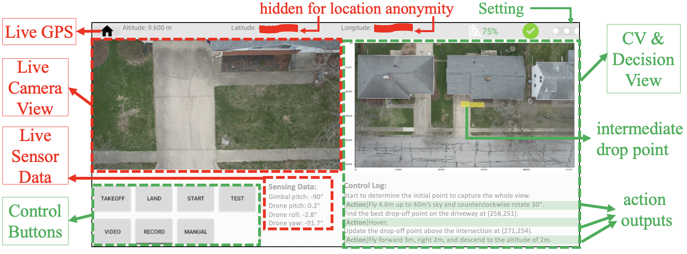

# Autonomous Drone Delivery

This repository includes the APK to build an Android app __SimpleFlyDJI__ that can be used for drone delivery based on DJI drone. Please check our paper **SSS: Towards Autonomous Drone Delivery to Your Door Over House-Aware Semantics.** 

The demo video is available at [youtube.](https://youtu.be/090d-8ZvHyw.)

## Usage
### APK Download
We provided the [APK](https://drive.google.com/drive/folders/1juwe1bgjZ3ggiyfgzkegba2qJqw7Iuse), it can be directly used to install on your own Android phone. Tested with Galaxy S23 and Pixel 5. Ensure that your phone has a minimum of 8 GB of memory to ensure proper functionality of our app. 

* Connect your phone to the computer using a USB cable and transfer the APK file to your phone's storage. 
* Click on the file to initiate the installation process, and then follow the prompts to install the application.

### How to reproduce the drone delivery.
Once the app is opened, it will first enter the cover page and present the connection status. When launching the app for the first time, ensure your phone is connected to a network for app authentication. 

When a DJI drone is connected, it will display the product type and show an image of connected model. Tested with DJI Air2s and Phantom 4 ProV2. If no product is detected, please click `...`, it will pop up a dialog to redirect to DJI website to give you the guide on how to connect to the drone. An active button labeled `ENTER DEVICE` will permit access to the operational page as follows:

Before the takeoff, click `...` to do some settings:

* Set the flight ID, which will be used to be put in front of the log, caputred frame for better indexing. 
* Select the sensing data want to display.

Then click `TAKEOFF` to initiate the drone takeoff, which will automatically hover at a 1-meter altitude.

Use remote controller to control the drone to fly to reach the airspace above the target SFH and adjust the camera to a downward-facing position. Then click `START` and select `VECOLITY for Z` and `ANGULAR for Yaw`. The drone will start to delivery automatically, the intermediate processing result will be rendered in the *CV & Decision view* and the action outputs will be shown in the *Control log*.

Click `LAND` to let the drone land.

**Click `MANUAL` anytime to switch control from automatic to manual mode (control by remote controller). This ensures safety in the presence of any potential risks**.

## Get the log and captured views
After finishing the experiment, please use USB to connect the phone. Then use `adb` command to get the stored sensing log and captured views:

For all the sesning log: including the IMU, battery and gimbal data.
	`adb pull /storage/emulated/0/Android/data/com.dji.simpleflydji/files/DJI/DJI_LOG/ [local_path`]
	
For all the captured view (1fps)

`adb pull /storage/emulated/0/Android/data/com.dji.simpleflydji/files/DJI/DJI_ScreenShot/ [local_path]`